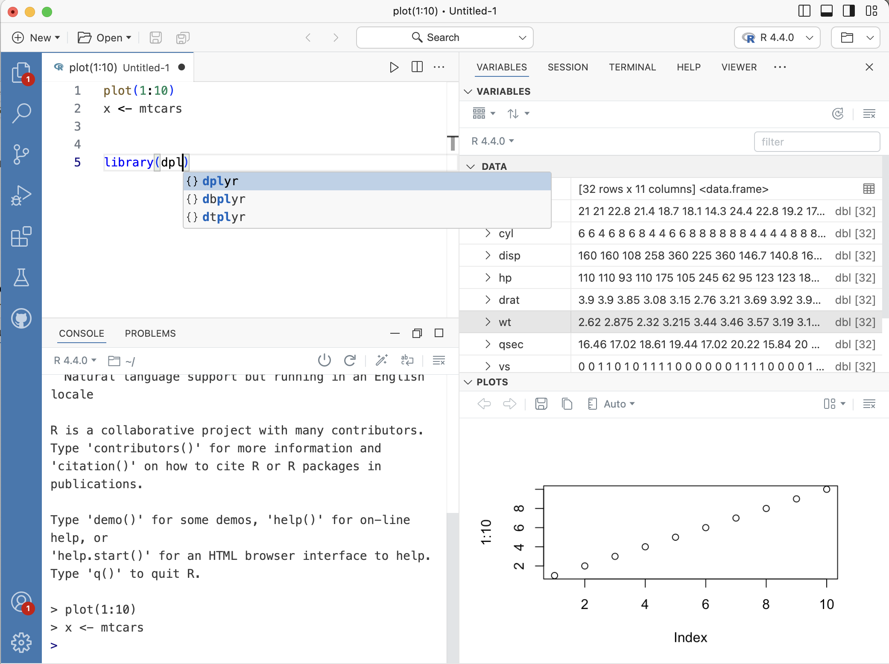
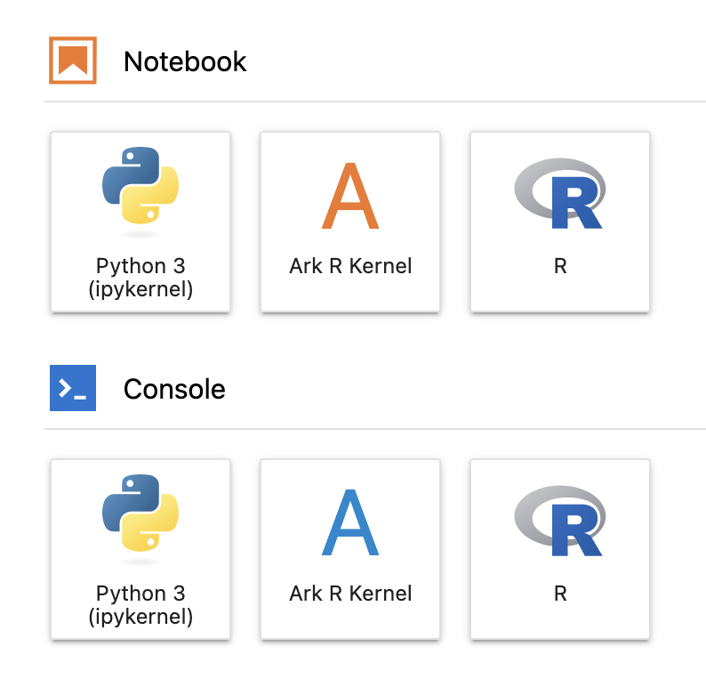

Ark, an R Kernel 
============================================================================

Ark is an [R](https://www.r-project.org) kernel for Jupyter applications. It was created to serve as the interface between R and the [Positron](https://github.com/posit-dev/positron) IDE and is compatible with all frontends implementing the Jupyter protocol.

Ark aims to provide a complete set of reusable and interoperable tools for implementing IDEs for R:

- It is a [Jupyter kernel](https://jupyter.org) that provides structured interaction (inputs and outputs) between R and a frontend.

- It is an [LSP server](https://microsoft.github.io/language-server-protocol) that powers intellisense features such as completions, jump-to-definition, find-references, diagnostics, etc. It also has some formatting capabilities that we plan to develop over time.

- It is a [DAP server](https://microsoft.github.io/debug-adapter-protocol) for sophisticated step-debugging of R functions. It manages source references, creating them on the spot if needed, and integrates tightly with the Jupyter kernel to step through R code transparently and inspect local variables. Note: Support for breakpoints is currently missing but you can use `debug()`, `debugonce()`, or `browser()` to drop into the debugger.

The LSP and DAP features are currently only available in Positron but will be made available to other frontends in the future.


## Usage

### In Positron

The easiest way to try Ark without any installation or configuration is by running it in Positron. This is currently the only practical way to use the more advanced features of Ark that are provided by our LSP and DAP; this will change in the future as we continue to invest in Ark.

<p align="center">
    
</p>


### In Jupyter applications

Download a [release](https://github.com/posit-dev/ark/releases) of Ark to a location of your choice, such as `/usr/local/bin/ark` on macOS or Linux. Then install the Jupyter kernel specification file with:

```sh
$ ark --install
```

> [!NOTE]
> Ark is currently not signed and notarized, so on macOS you will likely need to go to `System Settings -> Privacy and Security -> Click Allow Anyways for ark`, otherwise macOS will prevent you from running it. We are working on improving this. This does not apply when using the version of ark bundled within Positron.

Ark should now be available in jupyter applications, e.g. in Jupyter Lab:

<p align="center">
    
</p>

Or at the command line (if Jupyter Console is installed):

```sh
$ jupyter console --kernel=ark
```


## Related Projects

- [Positron](https://github.com/posit-dev/positron), a next-generation data science IDE. The R language pack in Positron interfaces with the Ark kernel for interactive evaluation of R code and collecting outputs and plots. It also connects to the Ark LSP for intellisense features like completions, jump-to-definition, find-references, etc, and to the Ark DAP for transparent debugging.

- [IRKernel](https://github.com/IRkernel/IRkernel), a Jupyter kernel for R written primarily in R itself. IRkernel is an R package easily installable from CRAN that provides a level of integration to R similar to [R Markdown](https://rmarkdown.rstudio.com) or [Quarto](https://quarto.org). As our main goal for Ark was to be used in Console mode in addition to Notebook mode, we implemented it as a native frontend to R. Ark binds natively to the exported C API of R intended for frontends like RStudio, providing an experience very close to what you get when running R in the terminal or RStudio.

- [languageserver](https://github.com/REditorSupport/languageserver), a server that implements the [LSP protocol](https://microsoft.github.io/language-server-protocol/) for R, written primarily in R itself. We decided to create our own LSP written in Rust for two reasons. Initially, we needed to tightly integrate with the Jupyter kernel to provide introspective features based on the current state of the R session. In the longer term, we plan to move towards sophisticated static analysis of R code. The Rust ecosystem is a great place for implementing powerful language servers thanks to frameworks like [Tower-LSP](https://github.com/ebkalderon/tower-lsp) or the libraries for static analysis and incremental computation such as those contributed by the authors of [Rust Analyzer](https://github.com/rust-lang/rust-analyzer).

- [vscDebugger](https://manuelhentschel.github.io/vscDebugger), a server that implements the [DAP protocol](https://microsoft.github.io/debug-adapter-protocol) for R, also written in R as an R package. By comparison, our DAP server is tightly integrated into our Jupyter kernel. This makes it possible to smoothly integrate with the currently running R session and start debugging at any time without any prerequisite steps.

## Code of Conduct

Please note that this project is released with a [Contributor Code of
Conduct](https://github.com/posit-dev/ark?tab=coc-ov-file). By participating
in this project you agree to abide by its terms.

## License

Copyright (C) Posit Software, PBC. All rights reserved.

Ark is licensed under the [MIT License](https://github.com/posit-dev/ark?tab=MIT-1-ov-file). 
