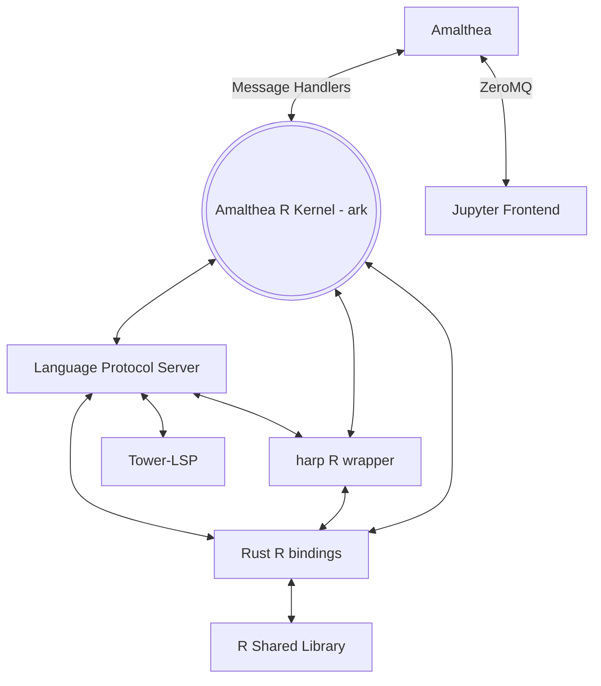

# Amalthea

## About

Experimental kernel framework and R kernel for Jupyter and Positron, written in Rust.


This repository contains five individual projects, which are evolving together.

- **Amalthea**, a Rust framework for building Jupyter and Positron kernels.
- **ARK**, the Amalthea R Kernel. ARK is a native kernel for R built on the Amalthea framework that interacts with the R interpreter in the same way RStudio does (it's a real frontend). It also implements the Language Server Protocol, using [tower-lsp](https://github.com/ebkalderon/tower-lsp).
- **echo**, a toy kernel for a fictional language that can be used to experiment with the kernel framework without the nuisance of getting language bindings working. As the name implies, it is a language that just echoes its input back as output.
- **harp**, safe Rust wrappers for R objects and interfaces.
- **stdext**, extensions to Rust's standard library for utility use in the other four projects.



For more information on the system's architecture, see the [Amalthea Architecture](https://connect.rstudioservices.com/positron-wiki/amalthea-architecture.html) section of the Positron Wiki.

### What's with the name?

This is a Jupyter kernel framework; Amalthea is [one of Jupiter's moons](https://en.wikipedia.org/wiki/Amalthea_(moon)).

### Amalthea R Kernel Usage

#### Building

Install Rust. If you don't already have it, use `rustup`, following the [installation instructions at rustup.rs](https://rustup.rs/). In brief:

```bash
$ curl --proto '=https' --tlsv1.2 -sSf https://sh.rustup.rs | sh
$ source $HOME/.cargo/env
```

Assuming you have a working Rust toolchain, you can just run `cargo build` followed by the post-install script:

```bash
$ cargo build && scripts/post-install.sh
```

#### Standalone

To use ARK as a standalone kernel (outside Positron), install the kernelspec. From the repository root:

```bash
$ ./target/debug/ark --install
```

This installs a JSON file to the Jupyter kernel registry. After it completes, the Amalthea R kernel (ARK) will be available on all Jupyter frontends on your system (Notebook, Lab, Positron, etc.).

You will usually want to tweak the **ark** environment for development; add this to `~/Library/Jupyter/kernels/ark/kernel.json`:

```json
  "env": {
    "RUST_LOG": "trace",
    "R_HOME": "/Library/Frameworks/R.framework/Resources"
  }
```

where `R_HOME` is the location of your R installation. If you're unsure where this is, run `R RHOME`
and it will be printed to the console.

More fine-grained control of logging is available for `RUST_LOG` as documented in [env_logger](https://docs.rs/env_logger/0.9.0/env_logger/#enabling-logging).

#### In Positron

By default, the Amalthea kernel is included in Positron's `positron-r` extension, as a submodule; it
powers the R experience in Positron.

## Related Projects

[Positron](https://github.com/rstudio/positron), a next-generation data science IDE

[Xeus](https://github.com/jupyter-xeus/xeus), a C++ base/reference kernel implementation

[IRKernel](https://github.com/IRkernel/IRkernel), a kernel for R written primarily in R itself

[EvCxR Kernel](https://github.com/google/evcxr/tree/main/evcxr_jupyter), a kernel for Rust written in Rust

[Myriac Console](https://github.com/rstudio/myriac-console), an experimental Jupyter frontend

[tower-lsp](https://github.com/ebkalderon/tower-lsp), an LSP framework built on [Tower](https://github.com/tower-rs/tower), which is itself built on [tokio](https://tokio.rs/).

[tower-lsp-boilerplate](https://github.com/IWANABETHATGUY/tower-lsp-boilerplate), an example LSP built with `tower-lsp`
