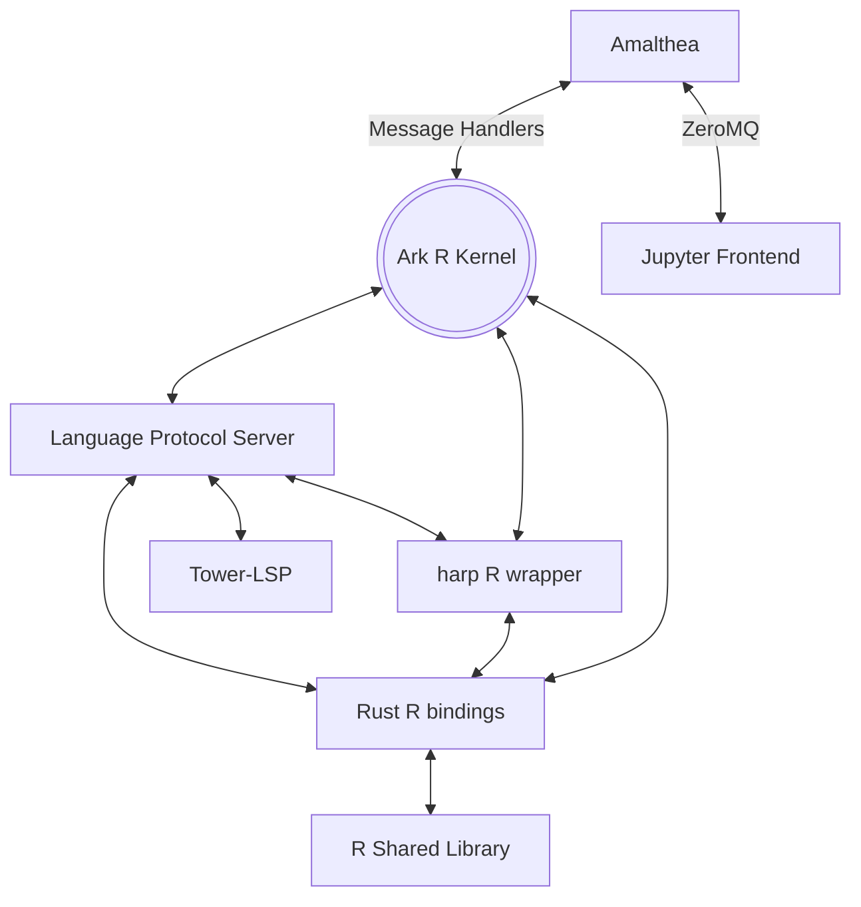

# amalthea

## About

## What's with the name?

This is a Jupyter kernel framework; Amalthea is [one of Jupiter's moons](https://en.wikipedia.org/wiki/Amalthea_(moon)).

## Related Projects

[Positron](https://github.com/posit-dev/positron), a next-generation data science IDE

[Xeus](https://github.com/jupyter-xeus/xeus), a C++ base/reference kernel implementation

[EvCxR Kernel](https://github.com/google/evcxr/tree/main/evcxr_jupyter), a kernel for Rust written in Rust

[tower-lsp](https://github.com/ebkalderon/tower-lsp), an LSP framework built on [Tower](https://github.com/tower-rs/tower), which is itself built on [tokio](https://tokio.rs/).

[tower-lsp-boilerplate](https://github.com/IWANABETHATGUY/tower-lsp-boilerplate), an example LSP built with `tower-lsp`
