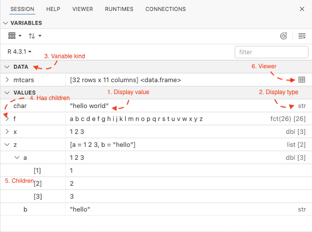

# Extending the variables pane

Ark enables package authors to customize the variables pane for specific
R objects by implementing custom methods, similar to S3 methods.




### `ark_variable_display_value`

Used to customize the display value of an object. It's called by the variables
pane to produce the text that's marked as "1. Display value" in the above screenshot.

Example:

```r
#' @param x Object to get the display value for
#' @param width Maximum expected width. This is used as a reference, the UI can truncate
#'  the string in different widths.
ark_variable_display_value.foo <- function(x, ..., width) {
    "Hello world" # Should return a length 1 character vector.
}
```

### `ark_variable_display_type`

Called by the variables pane to obtain the display type of an object. The display type
is shown in the screenshot above as "2. Display type".

Example:

```r
#' @param x Object to get the display type for
#' @param include_length Boolean indicating if the display type should also include the
#'   object length.
ark_variable_display_type.foo <– function(x, ..., include_length) {
    sprintf("foo(%d)", length(x))
}
```

### `ark_variable_kind`

Returns the kind of the variable, which can be used by the UI to show the variable in
different orders in the variable pane. Currently only `"table"` is used. You can find
the full list of possible values [here](https://github.com/posit-dev/ark/blob/50f335183c5a13eda561a48d2ce21441caa79937/crates/amalthea/src/comm/variables_comm.rs#L107-L160).

Example:

```r
#' @param x Object to get the variable kind for
ark_variable_kind <- fuinction(x, ...) {
    "other"
}
```

## Inspecting objects

Package authors can implement methods that allow users to inspect R objects. This is the behavior
that allows the variables pane to display the structure of objects, similar to the `str` function
in R.

In order to allow inspecting objects, implement the `ark_variable_has_children`:

```r
#' @param x Check if `x` has children
ark_variable_has_children <- function(x, ...) {
    TRUE # TRUE if the object can be inspected, FALSE otherwise
}
```

Next, implement a pair of methods

- `ark_variable_get_children`: Returns a named list of objects that should be displayed.
- `ark_variable_get_child_at`: Get an element from the object

Example:

```r
ark_variable_get_children <- function(x, ...) {
    list(
        a = c(1, 2, 3),
        b = "Hello world",
        c = list(1, 2, 3)
    )
}

#' @param name Name to extract from `x`.
ark_variable_get_child_at <- function(x, ..., name) {
    # It could be implemented as
    # ark_variable_get_children(x)[[name]]
    # but we expose an API that doesn't require users to re-build
    # if there's a fast path to acess a single name.
    if (name == "a") {
        c(1, 2, 3)
    } else if (name == "b") {
        "Hello world"
    } else if (name == "c") {
        list(1, 2, 3)
    } else {
        stop("Unknown name: ", name)
    }
}
```
